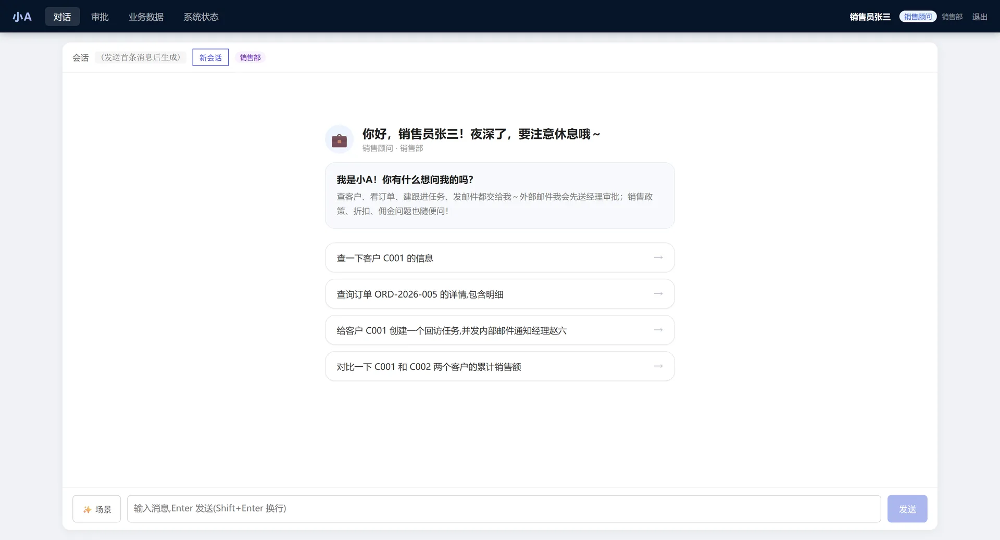

# Hello，小A——企业知识工作流 Agent

English documentation: [README_EN.md](README_EN.md)

> **免责申明：** 本项目仅供学习、研究和技术交流使用，禁止用于商业用途。项目中的第三方名称、商标、接口示例、模型及素材仅用于演示，可能涉及第三方知识产权或服务条款；使用者应自行核验授权与合规性，并承担使用本项目产生的全部责任。

基于 FastAPI、LangGraph、PostgreSQL、Redis 和 Milvus 的企业知识工作流 Agent。

[在线项目介绍](https://kingoftaro.github.io/hello-xiao-a/) · [从 0 到 1 项目搭建](docs/从0到1项目搭建.md) · [完整产品文档](docs/产品文档.md) · [部署指南](deploy/DEPLOY.md)

[](https://kingoftaro.github.io/hello-xiao-a/)

## 快速开始

### 前置要求

- Docker Desktop（包含 Docker Compose v2）
- 至少 8 GB 可用内存；首次构建会下载 Python 依赖和本地向量模型
- 一个 OpenAI 兼容接口的 API Key（默认示例使用 DeepSeek）

### 1. 克隆并进入项目

```bash
git clone <你的仓库地址>
cd hello-xiao-a
```

### 2. 创建本地配置

Windows PowerShell：

```powershell
Copy-Item .env.example .env
```

macOS/Linux：

```bash
cp .env.example .env
```

打开 `.env`，至少修改：

```dotenv
OPENAI_API_KEY=你的API密钥
OPENAI_BASE_URL=https://api.deepseek.com/v1
PRIMARY_LLM_MODEL=deepseek-chat
LITE_LLM_MODEL=deepseek-chat
JWT_SECRET_KEY=请替换为随机长字符串
```

开发环境中的 PostgreSQL、Redis 密码默认都是 `change-me`，并且已经与 `docker-compose.yml` 保持一致。若修改 `POSTGRES_PASSWORD` 或 `REDIS_PASSWORD`，只需修改 `.env`；Compose 会读取同一值。

### 3. 一键启动

```bash
docker compose up -d --build
```

首次构建需要下载 `BAAI/bge-m3` 等模型，耗时取决于网络。查看状态和日志：

```bash
docker compose ps
docker compose logs -f api
```

基础表和演示用户会由 PostgreSQL 首次启动时自动初始化。若要导入示例知识文档，请在服务就绪后执行一次：

```bash
docker compose exec api python -m app.rag.ingest eval/sample_docs --type policy --ns shared_company
```

同一批文档不要重复导入，否则 Milvus 中会产生重复分块。

启动成功后访问：

- Web 界面：http://localhost:8000/ui
- API 文档：http://localhost:8000/docs
- 健康检查：http://localhost:8000/health
- 就绪检查：http://localhost:8000/ready

停止服务：

```bash
docker compose down
```

如需同时删除本地数据库和模型卷，请确认数据不再需要后执行 `docker compose down -v`。

## 配置说明

真实配置写入 `.env`，该文件已被 Git 忽略；仓库只提交不含密钥的 `.env.example`。

| 配置组 | 主要变量 | 说明 |
| --- | --- | --- |
| LLM | `OPENAI_API_KEY`、`OPENAI_BASE_URL`、`PRIMARY_LLM_MODEL` | 必填；支持 OpenAI 兼容接口 |
| Embedding | `EMBEDDING_MODEL`、`EMBEDDING_DIM`、`LOCAL_MODEL_DEVICE` | 默认使用本地 `BAAI/bge-m3`、1024 维 |
| Milvus | `MILVUS_HOST`、`MILVUS_PORT`、`MILVUS_COLLECTION` | 容器启动时主机名会自动覆盖为服务名 |
| PostgreSQL | `POSTGRES_USER`、`POSTGRES_PASSWORD`、`POSTGRES_DB` | 应用状态和业务数据 |
| Redis | `REDIS_PASSWORD`、`REDIS_DB` | Checkpoint、限流和缓存 |
| JWT | `JWT_SECRET_KEY`、`JWT_ACCESS_TOKEN_EXPIRE_MINUTES` | 公开部署前必须更换密钥 |
| 可观测性 | `OTEL_ENABLED`、`OTEL_EXPORTER_OTLP_ENDPOINT` | 默认关闭；可配合 Jaeger 使用 |
| 外部系统 | `CRM_API_BASE`、`MAIL_API_BASE`、`TICKET_API_BASE` | 示例地址，接入真实系统时替换 |

若宿主机直接运行 Python，而不是运行 `api` 容器，`.env` 中的数据库主机保持 `localhost`。Docker Compose 会自动把容器内的主机覆盖成 `postgres`、`redis` 和 `milvus-standalone`。

## 可选监控

```bash
docker compose --profile monitoring up -d prometheus grafana jaeger
```

- Prometheus：http://localhost:9090
- Grafana：http://localhost:3000（开发默认密码为 `admin`）
- Jaeger：http://localhost:16686

若要发送链路数据，在 `.env` 中设置：

```dotenv
OTEL_ENABLED=true
OTEL_EXPORTER_OTLP_ENDPOINT=http://jaeger:4317
```

## 生产部署

先创建生产配置：

```bash
cp .env.prod.example .env.prod
```

把 `.env.prod` 中所有 `change-me` 替换成独立强密码，然后运行：

```bash
docker compose --env-file .env.prod -f docker-compose.prod.yml config
docker compose --env-file .env.prod -f docker-compose.prod.yml up -d --build
```

注意：`--env-file .env.prod` 不能省略，因为 Compose 在解析 `${POSTGRES_PASSWORD}` 等变量时需要它。生产部署还应配置 HTTPS，详见 `deploy/DEPLOY.md`。

生产 Nginx 启动前，还需要按照 `deploy/certs/README.md` 准备 `deploy/certs/server.crt` 和 `deploy/certs/server.key`。真实证书已被 Git 忽略。

备份脚本已经包含在 `scripts/backup.sh` 中；默认写入 `backups/` 并保留 7 天。

## 本地 Python 开发

```bash
python -m venv .venv
# Windows: .venv\Scripts\Activate.ps1
# macOS/Linux: source .venv/bin/activate
pip install -e ".[dev]"
docker compose up -d etcd minio milvus-standalone postgres redis
python -m app.main
```

## 项目结构

```text
app/                      应用源码
deploy/                   数据库、Nginx、Prometheus 与部署文件
docs/                     产品和使用文档
showcase/                 GitHub Pages 项目介绍页
eval/                     评测数据与验证脚本
scripts/                  维护脚本
.github/workflows/        GitHub 自动配置校验
.env.example              开发环境模板
.env.prod.example         生产环境模板
docker-compose.yml        开发环境
docker-compose.prod.yml   生产环境
```

## 安全提示

- 不要提交 `.env`、`.env.prod`、日志、数据库文件或私钥。
- 对外开放前必须修改 JWT、PostgreSQL、Redis、MinIO 和 Grafana 密码。
- `.env.example` 中的 `change-me` 仅用于本地快速体验。

## 提交前校验

```bash
python scripts/validate_project.py
docker compose -f docker-compose.yml config --quiet
docker compose --env-file .env.prod -f docker-compose.prod.yml config --quiet
```

GitHub Actions 会在每次 push 和 pull request 时自动执行相同的结构与 Compose 校验。

`showcase/` 会在 `main` 分支更新后自动发布到 GitHub Pages。首次使用时，请在仓库 `Settings → Pages → Build and deployment` 中把 Source 设置为 `GitHub Actions`。
